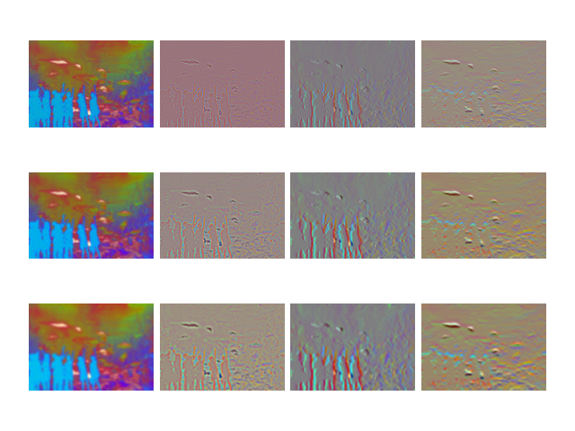
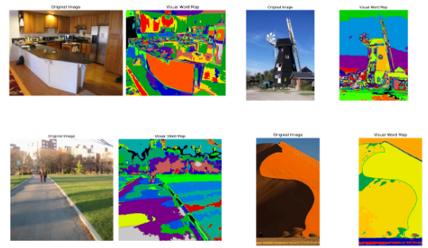

# Visual Bag-of-Words Scene Detection

## Overview
This project implements a **Visual Bag-of-Words (BoW) model** for scene detection using image feature extraction, clustering, and classification techniques. The system recognizes and classifies scenes based on visual patterns in images.

## Key Features
- **Feature Extraction:** Uses SIFT or ORB for keypoint descriptor extraction.
- **K-Means Clustering:** Clusters features to form a visual vocabulary.
- **Histogram Representation:** Transforms images into histograms of visual words.
- **Scene Classification:** Classifies scenes using the BoW model.

## Installation

1. Clone the repository:
    ```bash
    git clone https://github.com/AbhishekMathur11/Visual-Bag-of-Words-Scene-Detection.git
    cd Visual-Bag-of-Words-Scene-Detection
    ```

2. Install dependencies:
    ```bash
    pip install -r requirements.txt
    ```

## How It Works
## Key Steps

### Filter Response Extraction:
- Utilizes a multi-scale filter bank with Gaussian, Laplacian of Gaussian, and derivatives of Gaussian filters.
- Filters are applied at multiple scales to capture diverse visual properties.
  

### Visual Word Dictionary Creation:
- Filter responses are extracted from a subset of random pixels across all training images.
- **K-means clustering** is performed to create a dictionary of visual words, where each cluster center is a visual word.

### Visual Word Mapping:
- Each pixel's filter response is mapped to the nearest visual word, forming a **wordmap** for each image.

### Feature Extraction with Spatial Pyramid Matching (SPM):
- The image is divided into spatial cells at multiple resolutions (e.g., 1x1, 2x2, 4x4).
- Histograms of visual words are computed for each cell and concatenated into a feature vector.

### Classification:
- **Nearest-neighbor classification** based on histogram intersection.
- The test image's feature vector is compared to all training images, and the label of the most similar one is assigned.

### Evaluation:
- The system is evaluated using a test set, and a **confusion matrix** is generated.
- Overall accuracy is calculated as the percentage of correct classifications.

### Hyperparameter Tuning:
- Parameters include the number of filters, number of visual words (K), and number of spatial pyramid layers.


## Usage

To train and test the model, run the following:
```bash
python main.py --train_path <path_to_training_data> --test_path <path_to_testing_data>
